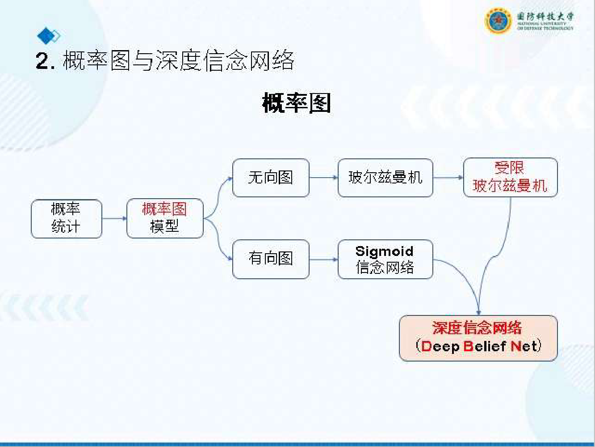

# 浅层神经网络

## *静态神经网络*

### 1. 三大核心定理（指导模型设计）
奥卡姆剃刀（Occam's Razor）：在效果相同的模型中，选择结构更简单的（避免过拟合）。
没有免费午餐（No Free Lunch）：没有一种算法能适配所有问题，需结合具体场景选择。
丑小鸭定理（Ugly Duckling）：所有样本在抽象层面平等，模型的学习效果依赖特征选择和标注。

### 2. 静态神经网络基础（入门核心）
定义与分类
静态神经网络：神经元输出仅依赖当前输入，与过去 / 未来输入无关（区别于动态神经网络，如 RNN）。
常见类型：
MLP（多层感知器）：核心重点，前馈式结构，依赖 BP 算法训练。
RBF（径向基函数网络）：基于距离度量的网络。
PRBF（概率 RBF 网络）：结合 EM 算法的概率模型。
PNN（概率神经网络）、Kohonen 网络（自组织映射）。
核心共性：研究成熟、应用广泛，核心问题是权值学习（如何通过数据调整连接权重）。

### 3. 停止准则（判断训练结束）
准则 1：梯度向量范数阈值$$∥g(W)∥<ϵ$$（g (W) 为梯度向量），缺点是计算量大。
准则 2：均方误差变化率$$​E(n−1)E(n)−E(n−1)​​<ϵ$$（E 为均方误差），常用。
准则 3：交叉验证法（验证集误差上升时停止，避免过拟合）。
准则 4：固定最大训练回合数（防止训练时间过长）。

### 4. BP算法的缺点与改进（深度考点）
核心缺点及原因

| 缺点	| 本质原因	| 表现 |
|:--------------------|:------------------------------|:------------------------------|
| 收敛速度慢	| 梯度下降步长难控制，隐含层误差传播间接	| 需大量训练回合才能达到稳定误差
| 易陷入局部极小值	| 损失函数是非凸函数，梯度下降仅能找到局部最优	| 不同初始权值可能导致最终误差差异大
| 梯度消失 / 爆炸	| 链式求导的连乘效应：Sigmoid 导数≤0.25，多层连乘→梯度→0；初始权值 > 1→连乘→梯度→∞	| 输入层附近权值几乎不更新（消失），或权值更新过大（爆炸）

### 5. MLP（多层感知机）和RBF（径向基函数）对比
* MLP 是全局逼近网络，依赖 BP 算法（梯度下降 + 链式求导），存在收敛慢、局部极小等问题；
* RBF 网络是局部逼近网络，基于函数逼近理论构造，学习速度快、逼近能力强；
* PRBF 在 RBF 基础上加入概率约束，适配分类任务；变分贝叶斯推断解决 EM 算法的局限性。普通 RBF 输出是确定性值，PRBF 通过概率约束将输出转化为后验概率，适配分类任务（基于贝叶斯定理）。

### 6. EM 算法的不足
* 缺失数据较多时收敛速度慢；
* 对初始参数敏感，易陷入局部极小；
* 某些模型的 M 步难以解析求解；
* E 步中后验概率的期望可能无法显式计算。

### 7. 变分贝叶斯推断（VB，EM 的进阶拓展）
核心动机：解决 EM 算法的局限性，通过 “变分近似” 替代精确后验概率计算，适用于复杂贝叶斯模型

### 8. 关键对比与总结（易考点）
#### RBF 与 MLP 的区别

|对比维度 |RBF 网络 |MLP 网络 
|:--------------------|:------------------------------|:------------------------------|
|网络结构|单隐层（输入→RBF→输出）|多隐层（输入→隐含→...→输出）
|逼近类型|局部逼近（仅邻近中心影响输出）|全局逼近（所有权值影响输出）
|学习方式|分两步（隐含层 + 输出层，独立）|端到端（BP 算法，链式求导）
|收敛速度|快（局部逼近 + 线性输出权值）|慢（梯度下降易震荡）
|激活函数|径向基函数（局部化）|Sigmoid/ReLU 等（全局 / 局部）
|适用场景|函数逼近、快速分类|复杂非线性任务、深度学习
#### RBF 与 PRBF 的区别

|对比维度|RBF 网络|PRBF 网络
|:--------------------|:------------------------------|:------------------------------|
|输出含义|确定性值（函数值 / 分类得分）|概率值（后验概率）
权值约束|无概率约束 | $$∑j​πjk​=1$$且$$πjk​≥0$$
|学习算法|最小二乘 / LMS |EM 算法（最大似然估计）
核心用途|回归、函数逼近|分类、概率预测
|模型特性|确定性模型|概率模型（含不确定性估计）

### 9. RBF章节核心结论
- RBF 网络：基于函数逼近理论，局部逼近特性使其学习快、精度高，适用于回归和快速分类；
- PRBF 网络：通过概率约束和 EM 算法，将 RBF 拓展到概率分类，解决了确定性模型的不确定性问题；
- 变分贝叶斯：是 EM 算法的通用拓展，通过变分近似处理复杂模型，适用于后验难解析的场景；
- 核心工具：K - 均值聚类（中心提取）、EM 算法（含缺失数据的 ML 估计）、坐标上升（VB 优化）。

## *动态神经网络*
### 1. 静态 vs 动态神经网络的核心区别

| 对比维度 | 静态神经网络 | 动态神经网络 (CHNN) |
| :--- | :--- | :--- |
| 反馈连接 | 无（前馈） | 有（神经元全互联，无自反馈） |
| 状态依赖 | 仅依赖当前输入 | 依赖当前输入 + 历史状态 |
| 核心任务 | 函数逼近、分类识别 | 联想记忆、优化计算 |
| 收敛性 | 无需考虑（一次性映射） | 必须保证（收敛到稳定态） |
| 数学工具 | 梯度下降、EM 算法 | Lyapunov 稳定性理论、梯度动力学 |

### 2. Lyapunov 稳定性定理（3 大核心定理）
针对自治系统（不显含时间t，$$X˙=f(X)$$）：

定理 1（稳定）：若存在正定函数V(X)，其沿系统轨迹的全导数V˙=dtdV​≤0（半负定），则系统平衡态Xˉ稳定；
定理 2（渐进稳定）：若存在正定函数V(X)，其全导数V˙<0（负定），则系统平衡态Xˉ渐进稳定（ $$limt→∞​∥X−Xˉ∥=0$$ ）；
定理 3（不稳定）：若存在函数V(X)（正定 / 半正定 / 不定），其全导数V˙>0（正定），则系统平衡态Xˉ不稳定。

### 3. 连续 Hopfield 神经网络（CHNN）核心模型：CHNN 的网络结构
核心特点：单层全互联反馈网络（无自反馈），神经元之间相互连接，无输入层 / 输出层之分（每个神经元既是输入也是输出）；
稳定性分析：CHNN 的核心是 “构造能量函数 + 证明其渐进稳定”，确保网络收敛到能量极小值点（稳定态 / 吸引子）。

### 4. CHNN 的核心优势与局限
**优势：**
* 并行计算，收敛速度快（适合实时优化）；
* 容错性强（初始状态含噪声仍能收敛到正确吸引子）；
* 硬件易实现（模拟电子线路即可搭建）；
**局限：**
* 能量函数构造难度大（需精准映射实际问题）；
* 可能收敛到局部极小值（非全局最优解）；
* 权值矩阵设计复杂（随问题规模增长而膨胀）。

### 5. 本章核心结论
* CHNN 是动态神经网络的代表，核心是 “能量函数 + Lyapunov 稳定性”，保证网络收敛到吸引子；
* 设计关键是 “问题→能量函数→权值 / 偏置” 的映射，需同时考虑约束项和目标项；
* 典型应用是 NP 难优化问题（如 TSP），通过能量极小化快速找到近似最优解；
* 核心工具：梯度动力学系统、Lyapunov 稳定性定理、LaSalle 不变性定理。

### 6. 时间离散 Hopfield 网络（DHNN）
* 连续 Hopfield 网络（CHNN）是模拟量输出，核心解决优化问题（如 TSP），状态随时间连续演化；
* 离散 Hopfield 网络（DHNN）是二值输出（1 或 - 1），核心解决联想记忆问题，状态按离散时间步迭代更新，关键是通过权值设计让目标模式成为网络 “吸引子”。

### 7. CHNN 与 DHNN 的核心区别

| 对比维度 | 连续 Hopfield (CHNN) | 离散 Hopfield (DHNN) |
| :--- | :--- | :--- |
| 输出类型 | 连续值 ( $$ v_i \in \mathbb{R} $$ ) | 二值 ( $$ v_i \in \{0, 1\} $$  或  $$ \{-1, 1\} $$ ) |
| 状态演化 | 连续时间（微分方程） | 离散时间（迭代公式） |
| 核心任务 | 优化计算（如 TSP） | 联想记忆（自联想 / 异联想） |
| 工作方式 | 同步并行（所有神经元同时更新） | 同步 / 异步（异步更稳定） |
| 权值要求 | 对称矩阵 ( $$ W_{ij} = W_{ji} $$ ) | 异步：对称矩阵；同步：非负定对称矩阵 |
| 能量函数 | 含激活函数反函数积分项 | 纯二次 + 线性项（无积分） |

### 8. DHNN稳定性定理

- 定理 1（异步工作方式）：若 DHNN 的权值矩阵W是对称矩阵（Wij​=Wji​），则对任意初始状态，网络必收敛到一个吸引子（稳定态）；
- 定理 2（同步工作方式）：若 DHNN 的权值矩阵W是非负定对称矩阵，则对任意初始状态，网络必收敛到一个吸引子；

关键结论：异步工作方式对权值要求更低（仅需对称），稳定性更好，应用更广泛；同步方式易出现自持振荡（需非负定约束）。

### 9. 吸引子与吸引域

- 吸引子：网络稳定态（V(k+1)=V(k)），对应能量函数的局部极小值点，实际应用中 “吸引子 = 目标记忆模式”；
- 吸引域：所有能收敛到同一吸引子的初始状态集合。吸引域越大，网络容错性越强（如含 1 个错误的模式仍能恢复到目标模式）

### 10. DHNN 的典型应用：自联想记忆

    **3 神经元 DHNN 存储 2 个模式**

- **目标模式**：$$X_1 = [1, -1, 1]^T$$，$$X_2 = [-1, 1, -1]^T$$ （$$N = 3$$，$$M = 2$$）；

- **权值计算（自联想公式）**：

  1. **计算每个模式的外积**：

     $$
     X_1 X_1^T = \begin{bmatrix}
     1 & -1 & 1 \\
     -1 & 1 & -1 \\
     1 & -1 & 1
     \end{bmatrix}, \quad
     X_2 X_2^T = \begin{bmatrix}
     1 & -1 & 1 \\
     -1 & 1 & -1 \\
     1 & -1 & 1
     \end{bmatrix}
     $$

  2. **叠加外积并减单位矩阵**：

     $$
     \sum_{m=1}^{2} X_m X_m^T - 2I = \begin{bmatrix}
     2 & -2 & 2 \\
     -2 & 2 & -2 \\
     2 & -2 & 2
     \end{bmatrix} - \begin{bmatrix}
     2 & 0 & 0 \\
     0 & 2 & 0 \\
     0 & 0 & 2
     \end{bmatrix} = \begin{bmatrix}
     0 & -2 & 2 \\
     -2 & 0 & -2 \\
     2 & -2 & 0
     \end{bmatrix}
     $$

  3. **归一化（除以 $$N = 3$$）**：

     $$
     W = \frac{1}{3} \begin{bmatrix}
     0 & -2 & 2 \\
     -2 & 0 & -2 \\
     2 & -2 & 0
     \end{bmatrix} = \begin{bmatrix}
     0 & -\frac{2}{3} & \frac{2}{3} \\
     -\frac{2}{3} & 0 & -\frac{2}{3} \\
     \frac{2}{3} & -\frac{2}{3} & 0
     \end{bmatrix}
     $$

- **联想测试（含噪声模式恢复）**：

  **输入含噪声模式** $$V(0) = [-1, -1, 1]^T$$ （与 $$X_1$$ 仅第一个元素不同）：

  1. **迭代 1（更新神经元 1）**：

     $$
     \sum_{j=1}^{3} W_{1j} V_j(0) = \frac{1}{3} \left( 0 \times (-1) + (-2) \times (-1) + 2 \times 1 \right) = \frac{4}{3} \geq 0 \implies V_1(1) = 1
     $$

     **状态变为** $$V(1) = [1, -1, 1]^T$$；

  2. **迭代 2（更新神经元 2）**：

     $$
     \sum_{j=1}^{3} W_{2j} V_j(1) = \frac{1}{3} \left( (-2) \times 1 + 0 \times (-1) + (-2) \times 1 \right) = -\frac{4}{3} < 0 \implies V_2(2) = -1
     $$

     **状态不变**；

  3. **迭代 3（更新神经元 3）**：

     $$
     \sum_{j=1}^{3} W_{3j} V_j(1) = \frac{1}{3} \left( 2 \times 1 + (-2) \times (-1) + 0 \times 1 \right) = \frac{4}{3} \geq 0 \implies V_3(3) = 1
     $$

     **状态不变，迭代终止**；

  4. **输出结果**：$$V(3) = [1, -1, 1]^T = X_1$$，**含噪声模式成功恢复**。

### 11. DHNN 的关键特性与局限（考试易考点）
#### 核心特性

- 联想记忆：从部分 / 噪声模式恢复完整目标模式（自联想）；
- 容错性：吸引域内的初始模式均可收敛到目标模式，抗噪声能力强；
- 分布式存储：所有模式存储在同一权值矩阵中，而非独立地址；
- 按内容寻址：无需输入完整地址，仅需部分内容即可 “回忆” 完整模式。

#### 局限性

- 信息容量有限：网络规模为N时，稳定存储的模式数M约为0.15N（超过后会出现 “交叉干扰”，模式相互混淆）；
- 伪吸引子：当模式数过多时，网络可能收敛到非目标的能量极小点（伪吸引子），导致联想错误；
- 权值设计依赖模式：目标模式需尽可能正交（减少干扰），否则存储容量会大幅下降。

#### 提高存储容量的方法

- 改进权值设计：采用 “反复学习法”（重复训练目标模式）、“纠错学习法”（修正错误权值）；
- 优化网络结构：增加神经元数量N，或采用分层 DHNN 结构；
- 模式预处理：对目标模式进行正交化处理（减少模式间相关性）。

# 深层神经网络

**深度学习模型发展脉络**
`MLP→CNN（空间特征）→RNN（时间特征）→LSTM/GRU（门控缓解梯度问题）→Transformers（自注意力+并行）→大模型（预训练+微调）`

## *CNN*

### 1. CNN 的层次化组成（核心模块）
CNN 由 “卷积层 + 池化层 + 全连接层” 交替堆叠组成，各层分工明确，实现层次化特征提取。

1. 卷积层（Feature Extraction）
核心作用：提取局部特征（边缘、纹理、部件），通过激活函数引入非线性；
数学描述：F=g(I∗K+b)，其中g(⋅)为激活函数（ReLU 为主）；

2. 池化层（Downsampling）
核心作用：降低特征图尺寸，减少计算量和过拟合，增强平移不变性；
本质：非参数化操作（无训练参数），分为采样分块和池化策略；

3. 经典案例：LeNet-5（CNN 鼻祖）
结构：输入（32×32×1）→C1（卷积层）→S2（池化层）→C3（卷积层）→S4（池化层）→C5（卷积层，等价全连接）→F6（全连接）→输出（10 类）；

### 2. CNN高效网络结构设计

1. 深度可分离卷积（Depthwise Separable Convolution）：
    - 拆分：将标准卷积拆分为 “深度卷积（Depthwise）+ 逐点卷积（Pointwise）”；
    - 计算量对比：标准卷积k×k×C×D×H×W，深度可分离卷积k×k×C×H×W+C×D×H×W，计算量减少为D1​+k21​（如 k=3，D=128，计算量仅为标准卷积的 1/8）；
2. 分组卷积（Group Convolution）：将输入通道分为 G 组，每组独立卷积，参数量减少为G1​，代表网络 ShuffleNet（通道洗牌解决组间信息隔离）；
3. 逆残差块（Inverted Residual）：先升维（1×1 卷积）再降维（深度卷积），保留更多特征，用于 MobileNetV2；
4. 全局平均池化（GAP）：替代全连接层，减少参数量，增强泛化能力（GoogLeNet、ResNet）。

### 3. 深度卷积神经网络（CNN）发展史概览

| 年份 | 核心创新 | 结构特点 | Top-5 错误率 (ImageNet) | 参数量 |
| :--- | :--- | :--- | :--- | :--- |
| LeNet-5 | 首个 CNN 架构（卷积-池化-全连接） | 5 层，输入 32×32×1，输出 10 类 | - | 6 万 + |
| AlexNet | ReLU、Dropout、数据增强、多 GPU | 8 层（5卷积+3全连接），11×11 大核 | 16.4% | 6000 万 + |
| ZFNet | 优化 AlexNet 超参数（7×7 核，s=2） | 与 AlexNet 相似，调整卷积核大小和通道数 | 11.7% | 6000 万 + |
| VGGNet | 多个 3×3 小核堆叠（替代大核） | 16/19 层，分 5 个卷积块，全连接层参数占比高 | 7.3% | 1.38 亿 + |
| GoogLeNet (Inception-v1) | Inception 模块（多尺度融合）、全局平均池化 | 22 层，无全连接层，参数高效 | 6.7% | 500 万 + |
| ResNet | 残差连接（解决深层网络退化） | 152 层，直连通路传递梯度，BatchNorm | 3.57% | 6000 万 + |
| DenseNet | 稠密连接（特征复用） | 各层与所有后续层连接，参数少，梯度传播好 | 3.7% | 800 万 + |
| MobileNetV1 | 深度可分离卷积（轻量化） | 适用于移动端，参数量仅 420 万 | 16.1% (MobileNet-1.0) | 420 万 |
| MobileNetV2 | 逆残差块、线性瓶颈 | 进一步减少计算量，精度提升 | 7.6% | 340 万 |

## *RNN*

### 1. 时间反向传播（BPTT）

#### 梯度消失 / 爆炸问题
- 原因：残差递推中包含WT的连乘，若W的最大奇异值$$σ_{max}​<1$$，则$$(WT)t−s→0$$（梯度消失）；若$$σ_{max}​>1$$，则$$(WT)t−s→∞$$（梯度爆炸）；
- 影响：梯度消失导致长程依赖无法建模（早期时间步的误差无法传递到后期），梯度爆炸导致训练发散。

#### 训练技巧（解决方案）
- 截断 BPTT（Truncated BPTT）：仅反向传播最近 k 个时间步的梯度，忽略早期步骤，缓解梯度消失；
- 梯度裁剪（Gradient Clipping）：当梯度范数超过阈值时，归一化梯度，避免梯度爆炸：$$if$$ $$∥∇L∥>θ⟹∇L=θ⋅∥∇L∥∇L​$$
- 层归一化（Layer Normalization）：对每个时间步的隐藏状态归一化，减少内部协变量偏移，替代 CNN 的批归一化（RNN 中批次维度不稳定）：$$ht​=f(σt​g​⊙(at​−μt​)+b)$$ 其中 $$μt​=C1​∑i=1C​at,i​，σt​=C1​∑i=1C​(at,i​−μt​)2$$​；
- 变分 Dropout（Variational Dropout）：同一时间步的 Dropout 掩码固定，避免普通 Dropout 破坏序列依赖。

### 2. RNN 的模型改进（解决长程依赖）
为解决梯度消失 / 爆炸，核心改进是门控机制，代表模型为 LSTM 和 GRU。

LSTM 与 GRU 对比

| 对比维度 | LSTM | GRU |
| :--- | :--- | :--- |
| 门控数量 | 3 个（遗忘、输入、输出） | 2 个（重置、更新） |
| 状态数量 | 细胞状态 + 隐藏状态 | 仅隐藏状态 |
| 参数量 | 更多 | 更少（约少 1/3） |
| 训练速度 | 较慢 | 较快 |
| 性能 | 复杂序列任务更优 | 普通序列任务相当 |

## *Transformers自注意力*

### 1. RNN 与 Transformers 的核心区别（考试高频考点）

| 对比维度 | RNN（含 LSTM/GRU） | Transformers |
| :--- | :--- | :--- |
| **依赖关系** | 序列依赖（逐时间步计算） | 无序列依赖（并行计算） |
| **长程依赖** | 依赖门控缓解，但效果有限 | 自注意力直接建模全局依赖 |
| **计算复杂度** |  $$ O(n) $$ （线性递归） |  $$ O(n^2) $$ （全局注意力） |
| **并行性** | 极差（无法并行，需按顺序计算） | 极佳（所有位置同时计算） |
| **核心创新** | 门控机制（解决梯度消失） | 自注意力（摆脱序列依赖） |
| **代表应用** | 短序列任务（如语音识别基础模型） | 长文本、大模型（GPT、BERT、ViT） |

### 2. Transformers 的核心组件
Transformers 由 6 大核心组件构成，缺一不可：
1. 多头注意力（Multi-Head Attention）
2. 位置编码（Positional Encoding）
3. 逐位置前馈网络（Position-wise FFN）
4. 残差连接（Residual Connection）
5. 层归一化（Layer Normalization）
6. 掩码机制（Mask）

### 3. GPT与BERT模型核心对比

| 对比维度 | GPT | BERT |
| :--- | :--- | :--- |
| 架构 | 解码器（掩码自注意力） | 编码器（多头自注意力） |
| 上下文方向 | 单向（自回归） | 双向（掩码） |
| 预训练任务 | 语言模型（LM） 根据上文预测下一个词 | 掩码语言模型（MLM） + NSP 预测被遮盖的词 + 判断句子关系 |
| 优势任务 | 生成类 文本生成、对话、代码 | 理解类 文本分类、情感分析、命名实体识别 |
| 并行性 | 训练：可并行 推理：自回归（串行） | 训练：全并行 推理：全并行 |

### 4. Transformers 的核心优势与局限

**优势：**
- 并行计算：摆脱序列依赖，训练效率大幅提升；
- 长程依赖：自注意力直接建模全局关联，无需门控；
- 通用性强：适配 NLP、CV、多模态等多个领域；

**局限：**
- 计算复杂度高：全局注意力为O(n2)，长序列（如 n>1000）效率低；
- 数据依赖性强：需大规模数据预训练，小数据场景表现不佳；
- 参数量大：训练需大量计算资源。

## *图神经网络*

### 1. 经典图表示方法

| 算法 | 核心创新 | 相似性类型 | 是否用节点特征 |
| :--- | :--- | :--- | :--- |
| DeepWalk | 随机游走 + Skip-gram | 路径重叠相似 | 否 |
| Node2Vec | 带偏好的随机游走 | 局部 + 全局相似 | 否 |
| 传统嵌入 | 邻接矩阵直接映射 | 直接相邻相似 | 否 |

### 2. GNN
GNN 的核心是 “消息传递框架”：$$hvk​=AGG({huk−1​∣u∈N(v)},hvk−1​)$$，即第k层节点表示由邻居节点的第k−1层表示聚合得到。

| 模型 | 聚合方式 | 学习类型 | 核心优势 | 局限性 |
| :--- | :--- | :--- | :--- | :--- |
| GCN 图卷积网络 | 加权平均（归一化） | 直推学习 | 参数共享、效率高 | 无自适应权重 |
| GAT 图注意力网络 | 注意力加权 | 归纳学习 | 自适应邻居重要性 | 计算复杂度高 |
| GraphSAGE 图采样生成网络 | 采样 + 灵活聚合 | 归纳学习 | 适配新节点、灵活 | 采样策略依赖经验 |
| GGNN 门控图神经网络 | GRU 门控聚合 | 归纳学习 | 深层稳定、梯度不消失 | 参数量大 |

### 3. GNN 的关键挑战与解决方案

1. 过平滑（Over-Smoothing）
`问题：堆叠过多 GNN 层，所有节点嵌入趋向一致，丧失区分度（“小世界” 效应，感受野快速覆盖全图）`

    解决方案：
    - 跨层连接（Skipped-GCN）：hvk​=σ(AGG(huk−1​)+hvk−1​)；
    - 图增强：添加虚拟节点 / 边、节点特征增强；
    - 限制层数（通常≤3 层）。

2. 训练方式：直推学习 vs 归纳学习
直推学习（GCN）：训练和测试在同一图上，仅预测未标注节点；
归纳学习（GraphSAGE、GAT）：训练后可迁移到新图 / 新节点，泛化能力强；
考点：区分两种学习方式的适用场景。

3. 损失函数
无监督学习（图结构监督）：基于随机游走的负采样损失（同 DeepWalk）；
监督学习（标签监督）：节点分类用交叉熵损失。

## *深度生成模型*

### 1. 生成模型概述

定义：假设数据来自某个未知概率分布，模型通过学习参数 θ，使模型分布 pθ​(x) 逼近真实数据分布 pdata​(x)；

### 2. 概率图与深度信念网络（DBN）（基础模型）
1. 核心铺垫：玻尔兹曼机（BM）

结构：无向全连接概率图，节点为二值变量（0/1）；
训练 / 采样：吉布斯采样（通过全条件概率迭代采样）。

2. 受限玻尔兹曼机（RBM）（考点重点）

结构：二分图（可观测层 v + 隐层 h），同层无连接，跨层全连接；
训练优化：对比散度（CD-k），替代传统吉布斯采样，降低计算复杂度；
核心优势：逐层训练，为 DBN 奠定基础。

3. 深度信念网络（DBN）（历史性模型）

结构：多层 RBM 堆叠，顶层为无向 RBM，下层为有向连接；
训练流程：逐层预训练（每层训练为独立 RBM）→ Wake-Sleep 算法微调；
三大贡献：首次实现深层生成建模、无监督预训练范式、神经网络生成式学习。

### 3. 生成对抗网络（GAN）

核心思想：对抗博弈：生成器 G 生成假样本，判别器 D 区分真假样本，二者交替优化达到纳什均衡

**变体**

| 变体名称 | 核心改进 | 适用场景 |
| :--- | :--- | :--- |
| DCGAN | 引入卷积神经网络架构（卷积 + 转置卷积），取消池化层，使用批量归一化。 | 图像生成：奠定了现代 GAN 的基础架构。 |
| WGAN | 使用 Wasserstein 距离替代传统的 JS 散度，并引入梯度裁剪机制。 | 解决训练不稳定：提供了更平滑的损失函数，解决了模式崩溃问题。 |
| CycleGAN | 引入循环一致性损失，实现无配对数据的双向图像生成。 | 域迁移：如照片转油画、马变斑马等风格转换任务。 |
| StyleGAN | 采用自适应实例归一化技术，将风格和内容进行分离控制。 | 高分辨率图像生成：能够精细控制图像的细节（如发型、肤色等）。 |

### 4. 核心生成模型对比

| 模型 | 建模方式 | 核心优势 | 核心缺陷 | 代表应用 |
| :--- | :--- | :--- | :--- | :--- |
| DBN (深度信念网络) | 概率图 + 逐层训练 由多层受限玻尔兹曼机堆叠而成，采用无监督的逐层贪心预训练。 | 开创深层生成范式 是早期解决深度网络梯度消失问题、实现深层网络训练的重要方法。 | 生成质量低，效率差 依赖马尔可夫链采样，生成速度慢，且生成的样本质量远不如现代模型。 | 早期特征学习 主要用于早期的无监督特征提取和预训练，现多用于教学回顾。 |
| GAN (生成对抗网络) | 对抗博弈（隐式） 通过生成器和判别器的极小极大博弈进行训练，学习生成数据的分布。 | 生成样本质量高，细节好 生成的图像通常非常逼真，锐利，细节丰富（如人脸、风景）。 | 训练不稳定，模式坍塌 训练过程难以收敛，容易出现模式崩溃（只生成少数几种样本）。 | 图像生成、风格转换 如 DALL-E、StyleGAN、CycleGAN 等。 |
| VAE (变分自编码器) | 变分推断（显式） 通过编码器将数据映射到隐空间，再通过解码器重构数据，显式定义了似然函数。 | 理论完备，无模式坍塌 基于严格的概率图模型推导，训练相对稳定，隐空间结构规整，便于插值。 | 生成样本模糊 由于使用了简单的先验分布（如高斯分布）和重构损失，生成的图像往往较模糊。 | 数据增强、隐变量建模 常用于生成新数据以扩充数据集，或学习数据的紧凑隐表示。 |
| 扩散模型 (Diffusion Models) | 逐步加噪 - 去噪（显式） 通过前向过程逐步破坏数据，再通过反向过程学习从噪声中恢复数据。 | 生成质量高，稳定 目前最先进的生成质量（如 DALL-E 2/3, Stable Diffusion），且训练非常稳定。 | 采样速度慢 生成样本需要多步迭代去噪，计算成本高（尽管已有加速方法，但仍慢于 GAN）。 | 文本到图像、高分辨率生成 当前 AIGC（AI 生成内容）领域的主流技术。 |

